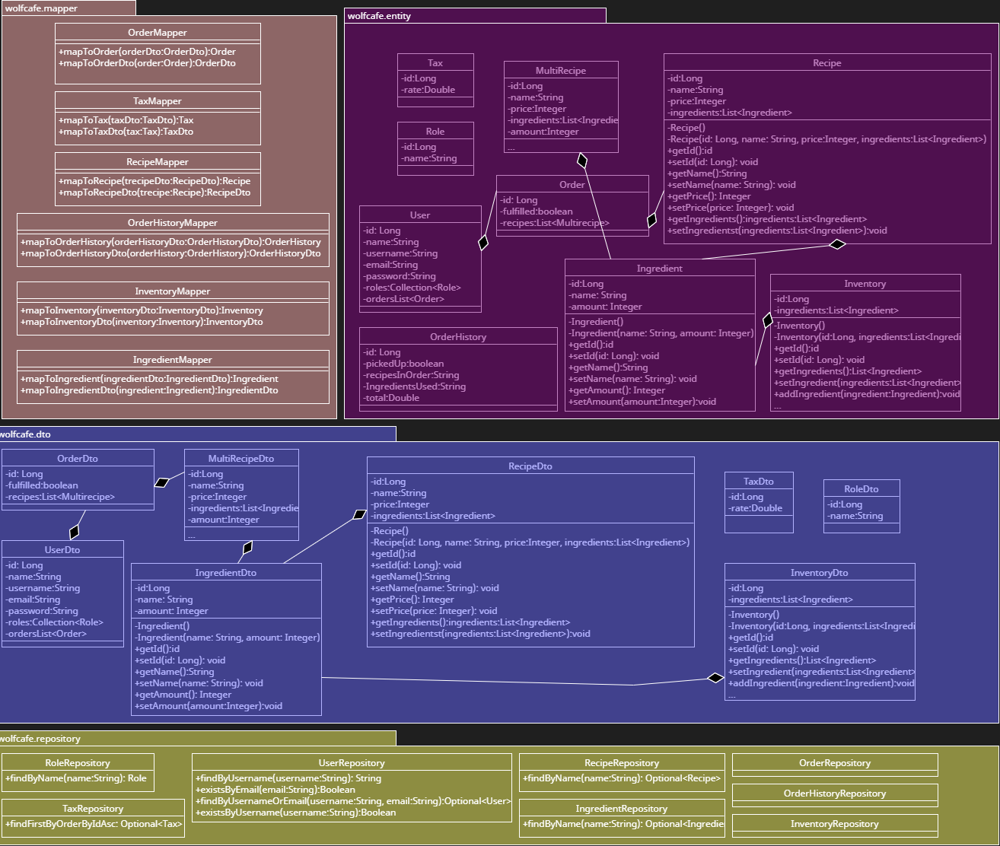
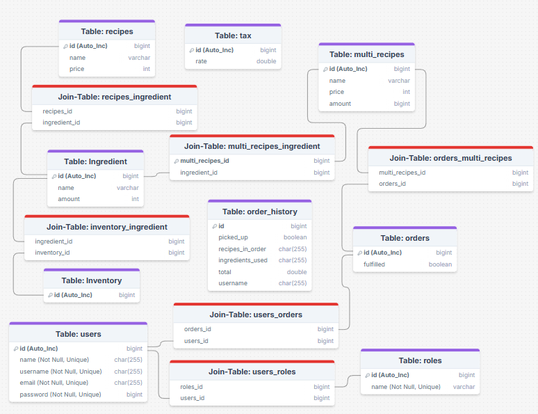
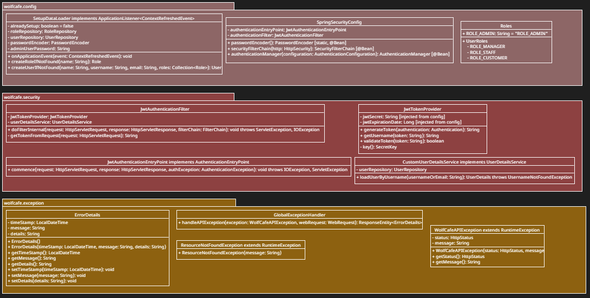
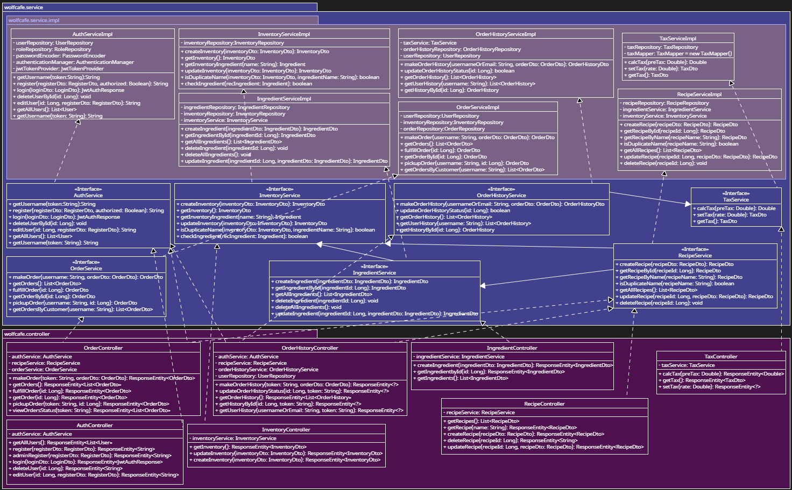

# ExtendedManager

### 📑 Table of Contents
- [Backend Design](#backend-design)
  - [Entity / DTOs / Mapper / Repo](#entity--dtos--mapper--repo)
  - [Config / Security / Exception](#config--security--exception)
  - [Service / Implementation / Controller / APIs](#service--implementation--controller--apis)
- [Frontend Design](#frontend-design)
- [Testing and Coverage](#testing-and-coverage)
- [Branch Management](#branch-management)
- [Setup Guide](#setup-guide)
  - [Environment Setup](#environment-setup)
  - [Eclipse Backend Setup](#eclipse-backend-setup)
  - [Eclipse Frontend Setup](#eclipse-frontend-setup)
- [Contributors](#contributors)

# Backend Design
- Note: Files for designs can be found under the Diagram folder.

## Entity / DTOs / Mapper / Repo

## Config / Security / Exception

## Service / Implementation / Controller / APIs

# Frontend Design

# Testing and Coverage

### Run Frontend Test
- remove wolf-cafe-frontend/node_modules and wolf-cafe-frontend/package-lock.jspn.
- In wolf-cafe-frontend, run npm install --save-dev vitest
- run npm install --save-dev @testing-library/react @testing-library/jest-dom @testing-library/user-event
- run npm run test to start tests.
- if you want to run coverage run npm run test:coverage
  
## Run Backend Test
You can run all of the tests at once by right clicking on the src/test/java folder and selecting Run As > JUnit.

## Run Maven Test
Right click on pom.xml and select Run As > 6 Maven Test
### WolfCafe Backend Statement / Branch Coverage

### WolfCafe Frontend Statement/Branch Coverage

# Branch Management
- Features should have their own unique branch off of the development branch
- Each feature branch should be split into two sub-branches for frontend (FE) and backend (BE)
- Ex: If you implement a Stock feature, the branching would be:
  - main <- development <- stocks <- stocks_BE
  - main <- development <- stocks <- stocks_FE

# Setup Guide

## Environment Setup
1. Install jdk-17 and Apache-Maven (make sure to test in terminal that they are local)
2. Add Maven certificate to your device
  - Go to https://repo.maven.apache.org and click the lock icon in URL bar
  - Select Certificate (Valid) and the certificate will pop up
  - Go to the details tab and click export in lower right corner
  - Dwnload file in Base-64 encoded and save it where it can be globally accessed
  - Add it to your jdk path using the command below: [note it uses my file locations, change it to your own]
    "C:\Program Files\Java\jdk-21\bin\keytool.exe" -import -trustcacerts -alias mavenRepo -file "C:\Users\[your username]\repo.maven.apache.org.crt" -cacerts -storepass changeit
  - Clean maven cache using: mvn dependency:purge-local-repository
  - Run maven build again: mvn clean install

## Eclipse Backend Setup
Import project into Eclipse
1. Open Eclipse Switch to the Java Perspective (upper right corner).
2. Open Git Repositories view: Window > Show View > Other > Git > Git Repositories
3. Clone the repo: Clone a Git Repo -> add clone URI and add your github credentials -> Click Next -> Click Next -> Optional: change local directory -> Click Finish
4. Import the Maven Project
 - In Package Explorer select Import Projects -> Maven -> Existing Maven Projects
 - Browse for the repository directory. The selected root directory should be local_path\ExtendedManager
 - Click Add project(s) to working set and click Finish
 - The project should be in the Package Explorer
5. Install Lombok
Lombok is a library that lets us use annotations to automatically generate getters, setters, and constructors.  For Lombok to work in Eclipse (and other IDEs like IntelliJ or VS Code), you need to set up Lombok with the IDE in addition to including in the pom.xml file.

Follow the [instructions for setting up Lombok in Eclipse](https://projectlombok.org/setup/eclipse).  Make sure you download the laste version of Lombok from [Maven Repository](https://mvnrepository.com/artifact/org.projectlombok/lombok) as a jar file.

6. Install Node.js
7.  Set up SQL: Make sure your SQL database is set up and running
  * In src/main/resource, make a copy of application.properties.template named application.properties [NOTE: the .gitignore stops it from being pushed to github for saftey measures] and in the files do the following:
  * Set `spring.datasource.password` to your local MySQL password`
  * Set `app.jwt-secret` by encrypting any phrase using SHA256 into app.jwt-secret, tool I used to generate it was https://emn178.github.io/online-tools/sha256.html
  * Set `app.admin-user-password` to a plain text string that you will use as the admin password.

8. Rightclick the pom.xml file and select Maven > Update Project then click Ok.
9. Run the project by right clicking on the project application and selecting Run As > Java Application.

## Eclipse Frontend Setup
1. In the Git Repositories View, open the arrow next to your repo and then the Working Tree Folder
2. Right click on coffee_maker_frontend and select Import Projects
3. Click Finish
4. Open Terminal View (Window > Show View > Terminal)
5. Create the node_modules directory by typing the following in the terminal: % npm install
6. Run the frontend by typing into the terminal: %npm run dev
7. View in browser by typing: http://localhost:3000

# Contributors
- The project is currently being ran by Brandon Wroblewski (BrandonWrob) and Andrew Anufryienak (
- The project is an extension of Store-Management-Application which was developed by Brandon Wroblewski (bnwroble), wtwalton, sadusum3, olweaver, and sesmith5.
